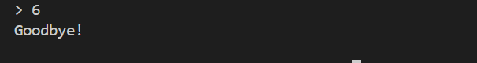

# Console Based Todo App

A simple command-line interface (CLI) application for managing todo tasks. This application allows you to add, list, and manage your daily tasks directly from your terminal.

## Features

- Add new tasks
- View all tasks
- Mark tasks as complete
- Delete tasks

## Prerequisites

To run this application, you need:

- Python 3.13 or newer

## Installation

1.  **Clone the repository:**
    ```bash
    git clone https://github.com/Muhammad-Rehan/Todo-In-Memory-Python-Console-App.git
    cd Console-Based-Todo-App
    ```

2.  **Create and Activate Virtual Environment:**
    It is highly recommended to use a virtual environment. This project includes a `venv` directory, and you can create and activate it as follows:

    ```bash
    # Create the virtual environment
    python -m venv venv
    ```

    Activate it:
    *   **Windows (Command Prompt/PowerShell):**
        ```bash
        .\venv\Scripts\activate
        ```
    *   **macOS/Linux (bash/zsh):**
        ```bash
        source venv/bin/activate
        ```

3.  **Install `uv` Package Manager:**
    This project uses `uv` for environment and package management. If you don't have it installed, you can install it using `pip` once your virtual environment is active:
    ```bash
    pip install uv
    ```
    *Note: Although this project has no external library dependencies, `uv` is the standard tool for managing this project's environment.*

## How to Run

**Important:** Ensure you have activated the virtual environment before running the application.

You can run the application using the provided batch script or directly via the Python interpreter.

### Option 1: Using `run.bat` (Windows)

Simply execute the `run.bat` file from the project root:

```bash
run.bat
```

### Option 2: Directly via Python

Navigate to the project's root directory and run the following command:

```bash
python -c "import sys; sys.path.insert(0, 'src'); from todo_app.cli.interface import TodoCLI; cli = TodoCLI(); cli.run()"
```

This command directly imports and runs the `TodoCLI` interface.

## Usage

Once the application is running, follow the on-screen prompts to manage your todo list.

## Usage Examples

Here are some screenshots demonstrating the application's functionality:

### Initial Run


### Add a Task


### View Tasks


### Update a Task


### Mark Task as Complete


### Delete a Task


### Exiting the Application


